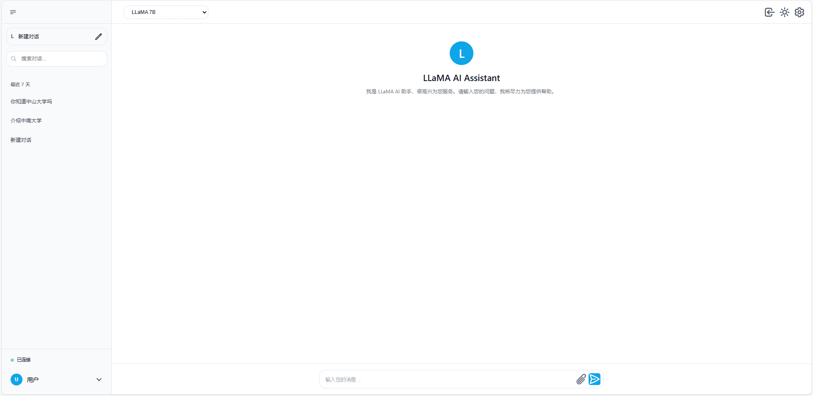
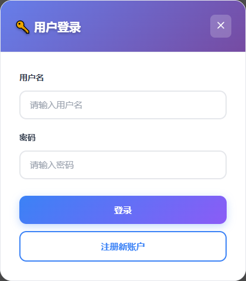
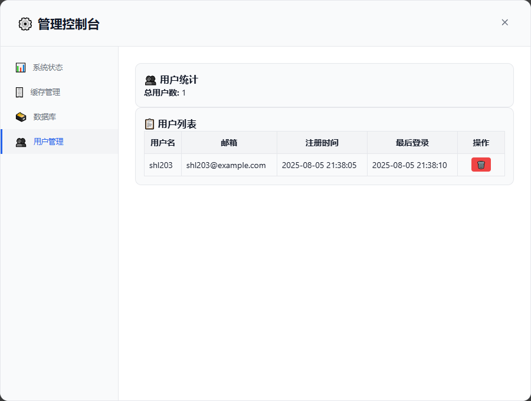

## ✨ 项目预览

<div align="center">

### 🎯 主对话界面



### 🔐 用户登录



### 📊 管理控制台  



</div>

---

## 🚀 快速开始

### 项目获取和配置

#### 1. 克隆项目
```bash
git clone https://github.com/xiaoben765/LlamaServer.git
cd LlamaServer
```

#### 2. 配置项目
编辑 `config/config.json` 文件，修改以下关键配置：
```json
{
  "llama_service": {
    "model_path": "/home/user/llama.cpp/models/qwen/qwen-7b-chat.q4_k_m.gguf",
    "host": "127.0.0.1", 
    "port": 8899,
    "timeout": 30,
    "max_retries": 3
  },
  "server": {
    "http_port": 8080,
    "thread_num": 4,
    "static_files_root": "./static"
  },
  "database": {
    "host": "127.0.0.1",
    "port": 3306,
    "user": "root",
    "password": "your_password",
    "db_name": "lama_llm"
  }
}
```

#### 标准部署流程
```bash
# 1. 编译项目
./build.sh

# 2. 启动所有服务
./start_services.sh

# 3. 访问Web界面
# 浏览器打开: http://localhost:8080/
```

### 访问服务

启动成功后，您可以访问以下地址：

| 服务 | 地址 | 说明 |
|------|------|------|
| **主界面** | http://localhost:8080/ | 类ChatGPT的对话界面 |
| **管理控制台** | http://localhost:8080/admin.html | 系统管理和监控 |
| **API文档** | http://localhost:8080/api/docs | RESTful API文档 |
| **系统状态** | http://localhost:8080/api/status | 服务运行状态 |
| **实时日志** | 查看logs目录 | 服务运行日志 |